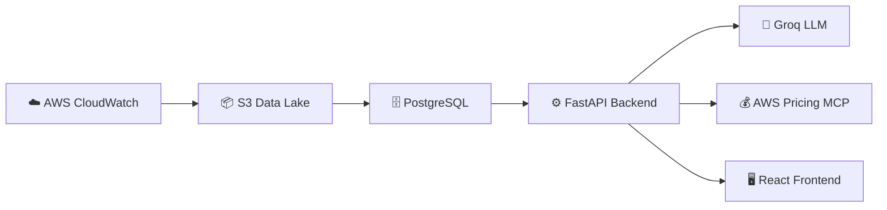
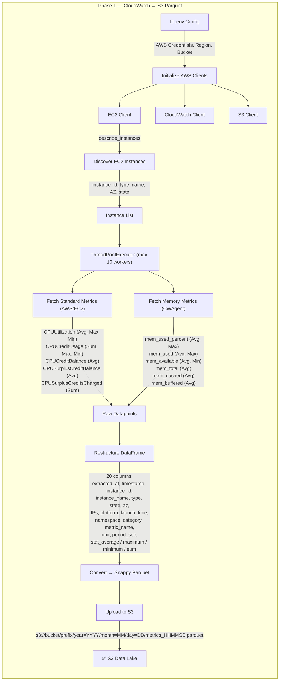
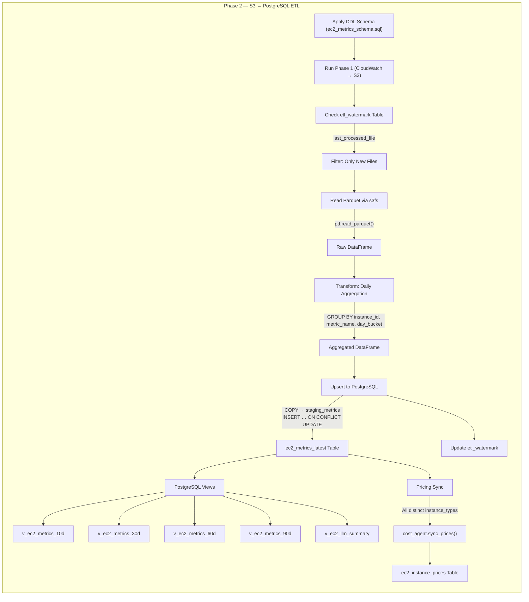
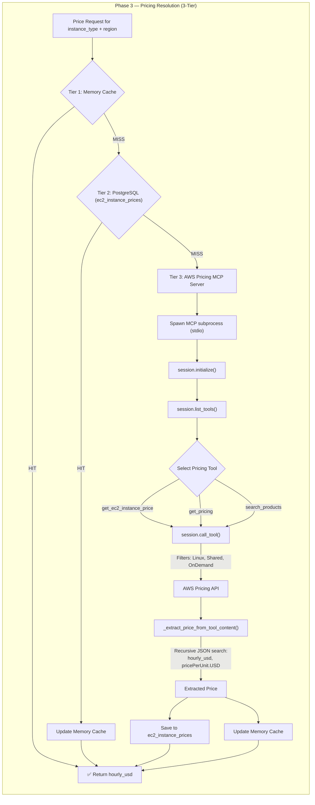
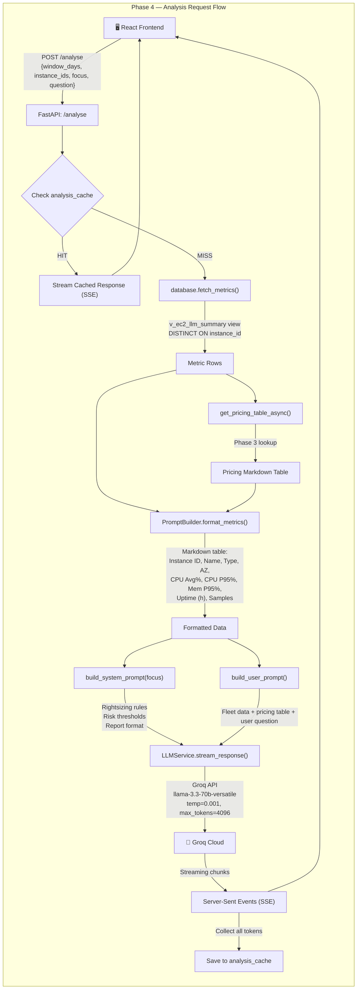
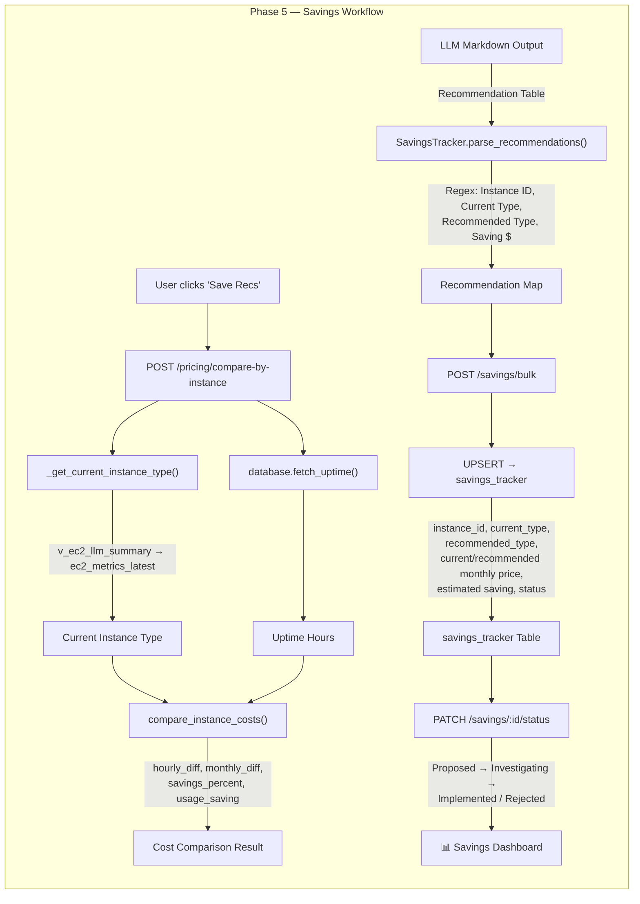
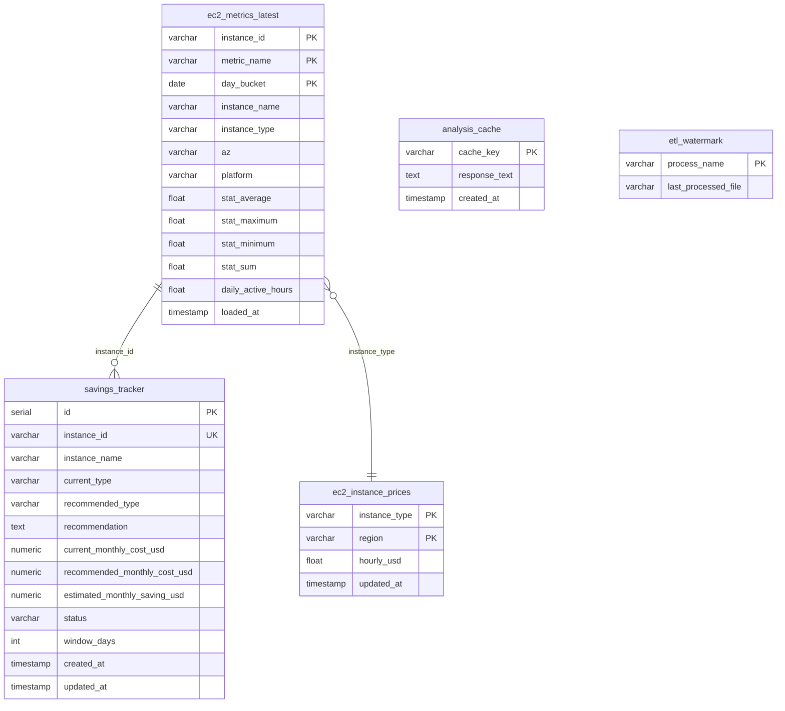

# EC2 Analysis Agent — End-to-End Data Flow

## High-Level Architecture

---

## Phase 1: Data Extraction — CloudWatch → S3

> **File:** `agent_backend/data/ec2_cloudwatch_metrics.py`

### Key Details:
| Aspect | Detail |
|---|---|
| **API Call** | `cw_client.get_metric_statistics()` |
| **Lookback** | Configurable (default 5 days) |
| **Period** | 60 seconds (1 min granularity) |
| **Parallelism** | Up to 10 threads |
| **Partitioning** | Hive-style `year=/month=/day=/` |
| **Compression** | Snappy (optimized for Athena/Glue) |

---

## Phase 2: ETL — S3 Parquet → PostgreSQL

> **File:** `agent_backend/data/cloud_agent.py`

### Transformation Rules:
| Input Stat | Aggregation | Purpose |
|---|---|---|
| `stat_average` | `mean()` | Representative daily average |
| `stat_maximum` | `max()` | Absolute peak for the day |
| `stat_minimum` | `min()` | Absolute trough for the day |
| `stat_sum` | `sum()` | Cumulative (network/disk throughput) |
| `daily_active_hours` | `(max_ts - min_ts) / 3600` | Instance uptime per day |

---

## Phase 3: Pricing Resolution

> **File:** `agent_backend/agents/cost/cost_agent.py`

### Concurrency & Caching:
| Aspect | Detail |
|---|---|
| **Semaphore** | Global limit of 1 concurrent MCP subprocess |
| **Timeout** | 10 seconds per instance type lookup |
| **Cache TTL** | 24 hours in memory, permanent in PostgreSQL |
| **Batch Prefetch** | Always fetches ~50 common "rightsizing target" types |
| **Monthly Calc** | `hourly_usd × 730` (standard AWS month) |

---

## Phase 4: Analysis — User Request → LLM Streaming

> **Files:** `agent_backend/main.py`, `agent_backend/agents/analysis/analysis_agent.py`

---

## Phase 5: Cost Comparison & Savings Tracking

> **Files:** `agent_backend/main.py`, `agent_backend/agents/orchestrator/savings.py`

---

## Complete Database Schema

---

## API Route Map

| Route | Method | Source File | Purpose |
|---|---|---|---|
| `/health` | GET | `main.py` | Health check |
| `/instances` | GET | `main.py` → `database.py` | List all EC2 instances |
| `/fleet-summary` | GET | `main.py` → `database.py` | Fleet utilization overview |
| `/analyse` | POST | `main.py` → `analysis_agent.py` | Stream LLM analysis (SSE) |
| `/auto-select` | POST | `main.py` → LLM → `database.py` | NL → SQL instance selection |
| `/timeseries` | GET | `main.py` → `database.py` | Daily metric charts |
| `/timeseries-compare` | GET | `main.py` → `database.py` | Multi-instance comparison |
| `/pricing` | GET | `main.py` → `cost_agent.py` | On-demand pricing lookup |
| `/pricing/compare` | POST | `main.py` → `cost_agent.py` | Compare two instance costs |
| `/pricing/compare-by-instance` | POST | `main.py` → `cost_agent.py` | Compare with uptime costs |
| `/parse-recommendations` | POST | `main.py` → `savings.py` | Parse LLM markdown server-side |
| `/uptime` | GET | `main.py` → `database.py` | Fleet uptime + costs |
| `/uptime/{id}` | GET | `main.py` → `database.py` | Single instance uptime |
| `/savings` | POST/GET | `main.py` → `savings.py` | Create/list savings entries |
| `/savings/{id}/status` | PATCH | `main.py` → `savings.py` | Update recommendation status |
| `/savings/bulk` | POST | `main.py` → `savings.py` | Bulk save from LLM output |
